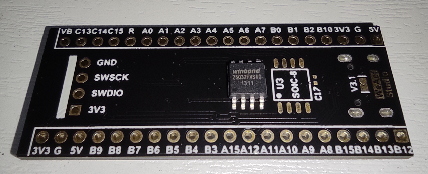
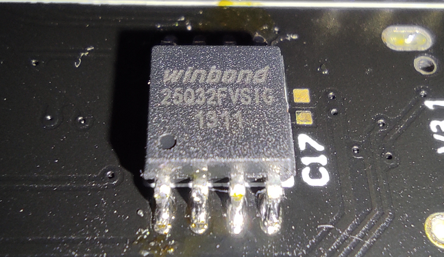

# Black PillをUSBメモリにする
Black Pill STM32F411にSPI Flashをつけて4MBのUSBメモリにする

以下のページを参考にしました
- [USB MSC Device with FLASH Memory](https://innomatic.home.blog/2018/12/24/usb-msc-device-with-flash-memory/)
- [FatFs with FLASH Memory](https://innomatic.home.blog/2018/12/24/fatfs-with-flash-memory/)

また、追加で以下のSPI Flashライブラリを使います
- [Winbond W25Q series tiny driver](https://github.com/tom01h/winbond-w25-flash-drv)

## 準備
この部品を  


はんだ付けする  


VB端子にRTCバックアップ電池を接続する  
(最初だけRTCの時刻設定をする (コメントアウトを外す))

## Project作成
project.md参照

## ソースコード準備
- STM32CubeIDEで生成したファイルの一部を、このリポジトリのファイルで上書きする
- [Winbond W25Q series tiny driver](https://github.com/tom01h/winbond-w25-flash-drv)をダウンロードする。
    - `spi.c, w25_flash.c` を `Core/Src/` にコピーする
    - `spi.h, w25_flash.h` を `Core/Inc/` にコピーする

## 実行
- STM32CubeIDEで書き込む
- PCにつなぐとUSBメモリとして認識する
    - 最初はフォーマットが必要
- 電源だけつなぐと `月日時分.TXT` ができる
- 電源だけつないだ時に `SETTIME.TXT` があると時刻を設定する
    ```
    22-09-23 20:11
    ```