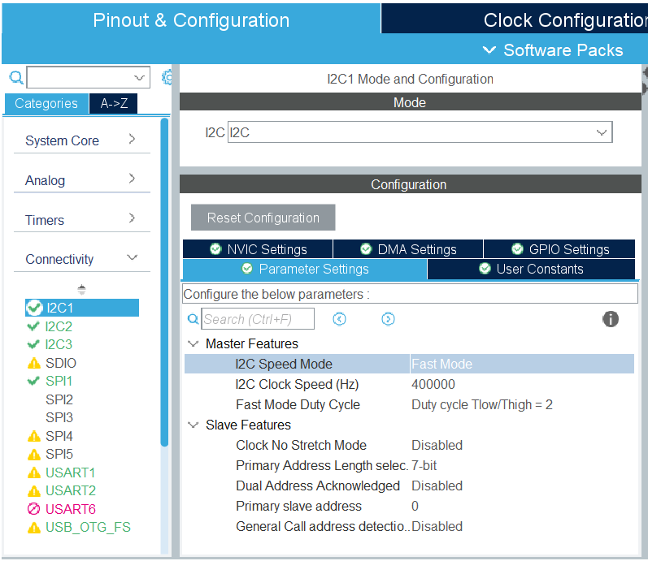
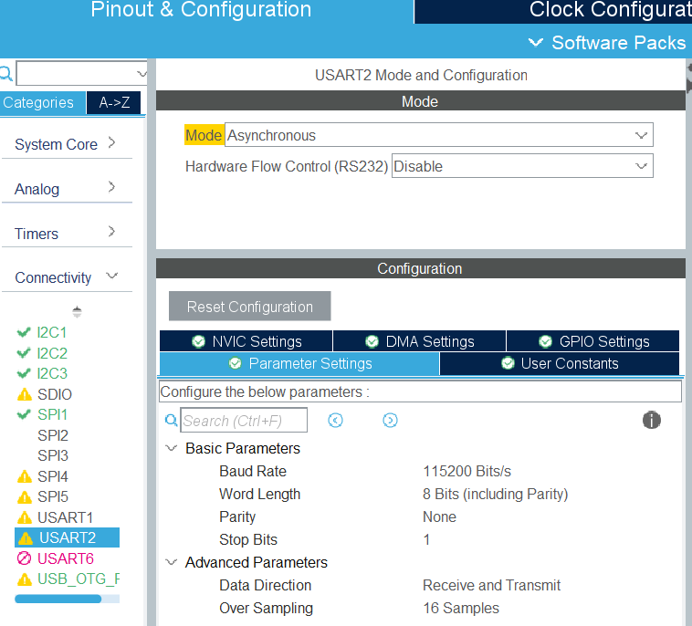
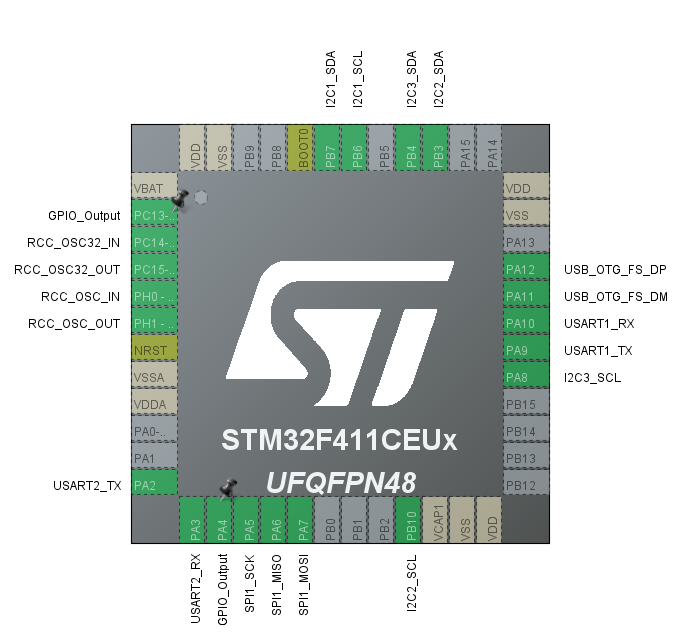

# オムロン製センサ 2SMPB-02E で高度を測る
I2Cに4個の2SMPB-02Eを接続して200msごとに高度を計測してメモリに保存する

以下のライブラリを使います
- [2smpb02e-st32cube](https://github.com/tom01h/2smpb02e-stm32cube)

## 準備
センサーモジュールは[TECHNOALTA-2SMPB-02E-G](https://www.marutsu.co.jp/pc/i/1358763/)を使っています

I2C1, I2C2に4個のセンサを接続する (I2C3は使っていない)  
I2Cアドレスを変更するためにSJ1をショートしたのがSDO=0の方  
`main_cpp.cpp`の以下の部分とI2Cの接続を一致させる
```
    SDO = 1;
    Omron2SMPB02E prs0(hi2c1, SDO);
    Omron2SMPB02E prs1(hi2c2, SDO);
    SDO = 0;
    Omron2SMPB02E prs2(hi2c1, SDO);
    Omron2SMPB02E prs3(hi2c2, SDO);
```

## Project作成
USBメモリを作るprojectに加えて以下の設定をします

#### 名前を決める
この時にTargeted LanguageをC++にすること

#### I2Cを使う設定
I2C1, I2C2, I2C3を有効にする  
Speed Mode は Fast Mode にする  


#### UARTを使う設定
UART1,2を有効にする  


#### 端子の設定


## ソースコード準備
- STM32CubeIDEで生成したファイルの一部を、USBメモリを作るprojectのファイルで上書きする
- さらに、このディレクトリのファイルで上書きする
- [Winbond W25Q series tiny driver](https://github.com/tom01h/winbond-w25-flash-drv)をダウンロードする。
    - `spi.c, w25_flash.c` を `Core/Src/` にコピーする
    - `spi.h, w25_flash.h` を `Core/Inc/` にコピーする
- [2smpb02e-st32cube](https://github.com/tom01h/2smpb02e-stm32cube)をダウンロードする。
    - `Omron2SMPB02E.cpp` を `Core/Src/` にコピーする
    - `Omron2SMPB02E.hpp` を `Core/Inc/` にコピーする

## 実行
- STM32CubeIDEで書き込む
- PCにつなぐとUSBメモリとして認識する
    - 最初はフォーマットが必要
- 電源だけつなぐと、標高データ(単位は㎝)のログファイル `月日時分.CSV` ができる
- 電源だけつないだ時に `SETTIME.TXT` があると時刻を設定する
    ```
    22-09-23 20:11
    ```