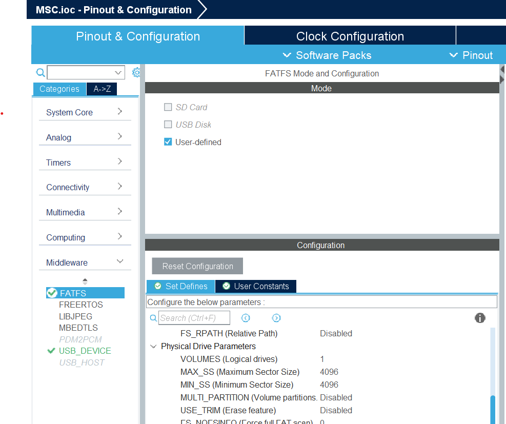
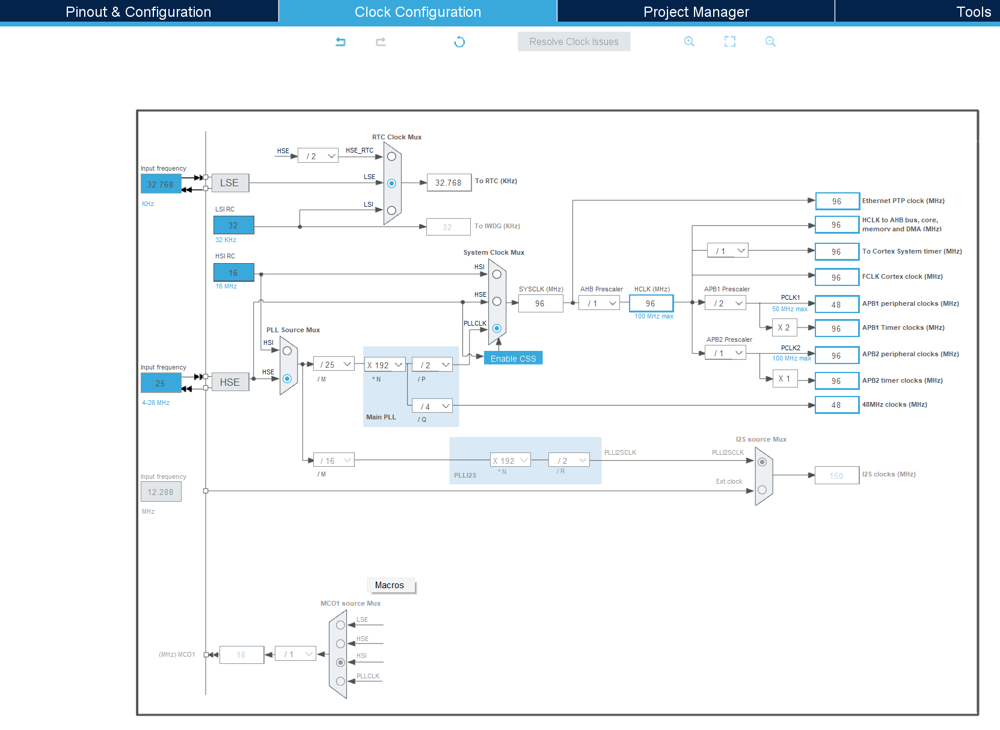

# Project設定
## Project作成
#### STMF411CEU6を選択

#### 名前を決める

## Pinout&Configurationタブ
#### 外部クロックを使う設定

#### SPIを使う設定

#### SPIのCS
GPIO PA4を出力で使う  

#### RTCを使う
なんか文句ありげに見えるけどこのまま  
Activate Calenderをチェックすると毎回時刻が初期化される  

#### USBの設定

#### USB Masstrage Classを使う
MSC_MEDIA_PACKETは4KB  

#### FATFSの設定
MAX_SS,MIN_SSを4096にする  

## Clock Confgurationタブ
USBのクロックは48MHzでないとダメ  
RTCのクロックを外部の32.768kHzにする  

## Project Managerタブ
Linker設定  
スタックとかヒープのサイズを増やす  

